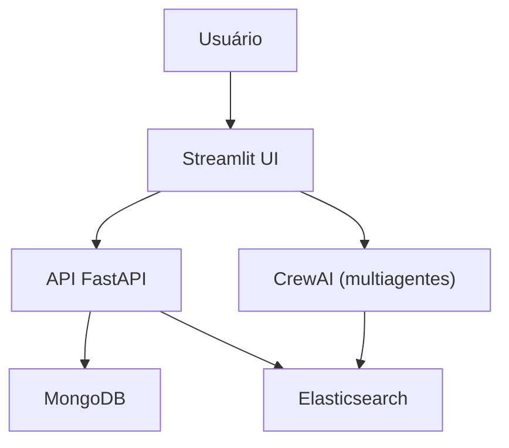
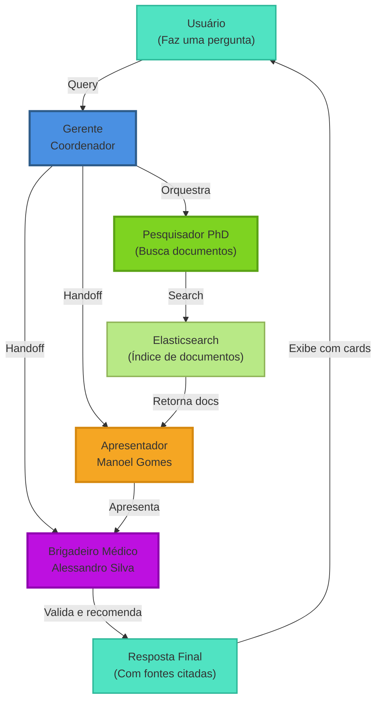

# HealthCom - Agentes Inteligentes para Hospitais

## Descrição do Projeto

Este projeto consiste em um MVP (Produto Mínimo Viável) de um sistema multiagente inteligente voltado para a área da saúde. O objetivo é facilitar a busca, análise e apresentação de informações extraídas de documentos médicos, utilizando técnicas modernas de IA, validação de dados, orquestração de agentes e interface amigável.

O sistema permite que usuários façam upload de documentos PDF, que são processados, indexados e disponibilizados para busca inteligente. A interação com o sistema é feita via uma interface Streamlit, onde múltiplos agentes (implementados com CrewAI) colaboram para responder perguntas, buscar informações e apresentar resultados de forma clara e acessível.

## Problema/Oportunidade

Profissionais de saúde frequentemente precisam buscar informações em grandes volumes de documentos. O processo manual é demorado e sujeito a erros. O MVP propõe um sistema inteligente que automatiza a extração, indexação e busca de informações, tornando o acesso ao conhecimento mais rápido e eficiente.

## Escopo do MVP

- Upload e processamento de documentos PDF.
- Indexação dos documentos no Elasticsearch.
- Busca textual com controle de acesso.
- Orquestração de múltiplos agentes para responder perguntas sobre os documentos.
- Interface de usuário simples via Streamlit.
- Validação de dados de entrada com Pydantic.

---

## Arquitetura do Sistema

O sistema é composto por:

- **API FastAPI**: Gerencia upload, download e busca de documentos.
- **Elasticsearch**: Armazena e indexa o conteúdo dos documentos.
- **MongoDB**: Armazena os arquivos PDF.
- **CrewAI**: Orquestra múltiplos agentes especializados (gerente, pesquisador, perito, apresentador).
- **Streamlit**: Interface de usuário para interação com os agentes.
- **Pydantic**: Validação dos dados de entrada.

### Diagrama Simplificado




---

## Tecnologias Utilizadas

- Python 3.13
- FastAPI
- Streamlit
- MongoDB
- Elasticsearch
- CrewAI
- pymupdf4llm

---

## Instruções de Instalação

1. Clone o repositório:
   ```bash
   git clone https://github.com/Mateus-Lacerda/health_com.git
   cd health_com
   ```

2. Instale as dependências:
 
    2.1. Com `pip`:
    ```bash
    python -m venv .venv
    source .venv/bin/activate
    pip install -r requirements.txt
    ```
    2.2. Com `uv`:
    ```bash
    uv sync
    ```

## Como executar o projeto localmente

1. Rodar com `compose`:
   ```bash
   docker-compose up -d
   ```

2. **API FastAPI** (se não estiver usando Docker):
   ```bash
   uvicorn src.api.v1.document:document_router --reload --host 0.0.0.0 --port 8000
   ```

3. **Interface Streamlit** (se não estiver usando Docker):
   ```bash
   streamlit run src/streamlit/agent.py
   ```

4. Acesse a interface em `http://localhost:8501`.

---

## Principais Funcionalidades

- **Upload de PDF**: Envie documentos para análise e indexação.
- **Busca Inteligente**: Pesquise conteúdos usando linguagem natural.
- **Controle de Acesso**: Resultados filtrados conforme o nível de acesso do usuário.
- **Multiagentes**: Respostas elaboradas por agentes especializados (gerente, pesquisador, perito, apresentador).
- **Interface Amigável**: Uso de Streamlit para facilitar a interação.
- **Timeline Visual**: Acompanhe em tempo real o progresso de cada agente
- **Rastreamento de Documentos**: Veja exatamente quais PDFs foram consultados
- **Cards Informativos**: Visualize detalhes dos documentos com links diretos

---

## Validação de Dados com Pydantic

Os dados de entrada (ex: upload de documentos) são validados usando modelos Pydantic para garantir integridade e segurança.

---

## Orquestração de Multiagentes (CrewAI)

O sistema utiliza CrewAI para coordenar diferentes agentes, cada um com um papel específico:
- Gerente de Projetos Sênior
- Pesquisador Acadêmico PhD
- Brigadeiro Médico da Aeronáutica
- Apresentador de Televisão Aposentado

### Diagrama de Fluxo dos Agentes



### Detalhes dos Agentes

| Agente | Papel | Responsabilidade |
|--------|-------|-------------------|
| **Gerente** (Kévio) | Coordenador | Orquestra a crew e garante que todos os agentes trabalhem em harmonia |
| **Pesquisador** (PhD) | Busca | Monta queries otimizadas para o Elasticsearch e recupera documentos relevantes |
| **Apresentador** (Manoel Gomes) | Comunicação | Lê os trechos dos documentos e apresenta de forma clara e expositiva, citando as fontes |
| **Perito** (Brigadeiro) | Validação | Responde dúvidas específicas, valida informações e recomenda quando necessário consultar especialistas |

### Fluxo de Execução Detalhado

1. **Input**: Usuário faz uma pergunta via Streamlit
   - Interface mostra timeline de execução com 4 status visuais
   
2. **Manager**: Recebe a pergunta e coordena os agentes (Processo Hierárquico)
   - Status: 🎯 Coordenando agentes...
   - Resultado: ✅ Coordenação completa
   
3. **Researcher**: Busca documentos relevantes no Elasticsearch
   - Status: 🔬 Buscando documentos...
   - Output: Lista de documentos encontrados
   - Resultado: ✅ Busca concluída
   
4. **Conversational**: Extrai trechos e apresenta de forma clara
   - Status: 📺 Estruturando resposta...
   - Formato: Cada informação é citada com `(Documento: nome_do_arquivo.pdf)`
   - Resultado: ✅ Resposta estruturada
   
5. **Expert**: Valida a resposta e adiciona recomendações
   - Status: 🎖️ Validando informações...
   - Output: Recomendações de segurança e próximos passos
   - Resultado: ✅ Validação completa
   
6. **Output**: Resposta final com:
   - Texto estruturado e bem formatado
   - Cards visuais dos documentos utilizados
   - Links para visualizar documentos completos

### Interface Visual

- **Timeline em Cards**: Mostra o progresso de cada agente em tempo real
- **Logs de Execução**: Expander com detalhes técnicos (colapsável)
- **Documentos Encontrados**: Expander listando todos os PDFs consultados
- **Resposta Final**: Formatada e com indicadores visuais
- **Cards de Documentos**: Mostram filename, categoria e botão de visualização

---

## Embeddings e Busca

O conteúdo dos PDFs é convertido para texto e indexado no Elasticsearch com as seguintes características:

- **Análise de Texto**: Utiliza analyzer padrão com remoção de stopwords em português
- **TF-IDF (Term Frequency-Inverse Document Frequency)**: Algoritmo padrão do Elasticsearch para ranqueamento relevante
  - TF: Frequência do termo no documento
  - IDF: Raridade do termo na coleção (documentos que contêm termos raros têm maior peso)
- **Índice Invertido**: Permite buscas eficientes e rápidas
- **Filtros de Acesso**: Resultados filtrados conforme o nível de acesso do usuário

Isso permite buscas eficientes, relevantes e que priorizam documentos mais específicos para cada query.

---

## Exemplos de Uso

1. Faça upload de um PDF via interface.
2. Realize uma busca textual.
3. Veja a resposta dos agentes na interface Streamlit.

📖 **Para um exemplo completo e detalhado, consulte [USAGE_EXAMPLE.md](USAGE_EXAMPLE.md)**

---

## Resultados Obtidos

O MVP permite:
- Upload e indexação automática de documentos.
- Busca eficiente com controle de acesso.
- Respostas contextualizadas e apresentadas por agentes especializados.

---

## Screenshots


---

## Próximos Passos

Por se tratar de um MVP, pode ser que nenhuma das linhas de código que existem atualmente estejam em um possível estado de produção.
O foco foi na construção de um protótipo funcional, e não necessariamente em um código escalável ou otimizado.

### ✅ Melhorias Já Implementadas
- ✅ Indicadores visuais dos documentos usados para gerar as respostas
- ✅ Timeline em tempo real mostrando o progresso de cada agente
- ✅ Cards com informações dos documentos encontrados
- ✅ Logs de execução detalhados (colapsível)
- ✅ Citação de fontes em cada resposta

### 📋 Melhorias Futuras
- Implementação de um sistema de permissões mais robusto
- Destacar a seção exata do documento onde a informação foi encontrada
- Jobs assíncronos para processamento de documentos
- Interface com front-end de produção (pode ser até com FastAPI mesmo)
- Cache de buscas frequentes
- Histórico de conversas e análise de patterns
- Integração com modelos LLM mais avançados
- Sistema de feedback dos usuários para melhorar respostas

### ⚠️ Considerações Técnicas
- Eu particularmente não usaria frameworks de orquestração de agentes para produção
- Considerar uma arquitetura de microserviços para melhor escalabilidade
- Implementar rate limiting e quotas por usuário
- Adicionar monitoramento e alertas para detecção de anomalias

---

## Considerações Finais

Este MVP demonstra a viabilidade de um sistema inteligente multiagente para a área da saúde, integrando processamento de documentos, busca inteligente e apresentação de resultados de forma acessível.

---

## Contato

Dúvidas ou sugestões? Abra uma issue no repositório ou entre em contato comigo pelo e-mail `mlacerdam.ai@gmail.com`.

---

**Obs:** Para detalhes técnicos, consulte os arquivos de código-fonte e comentários inline.
