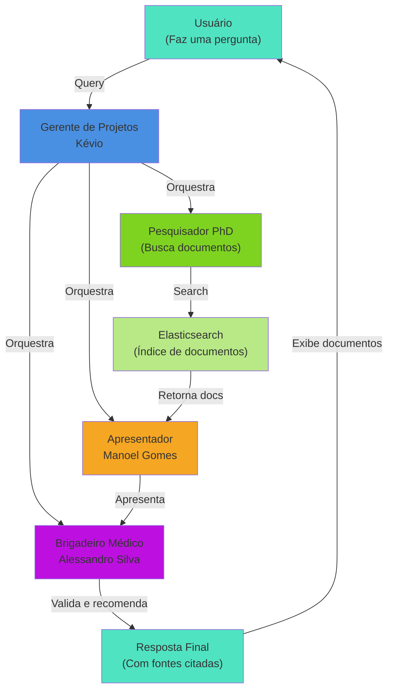

# HealthCom - Agentes Inteligentes para Hospitais

## Descrição do Projeto

Este projeto consiste em um MVP (Produto Mínimo Viável) de um sistema multiagente inteligente voltado para a área da saúde. O objetivo é facilitar a busca, análise e apresentação de informações extraídas de documentos médicos, utilizando técnicas modernas de IA, validação de dados, orquestração de agentes e interface amigável.

O sistema permite que usuários façam upload de documentos PDF, que são processados, indexados e disponibilizados para busca inteligente. A interação com o sistema é feita via uma interface Streamlit, onde múltiplos agentes (implementados com CrewAI) colaboram para responder perguntas, buscar informações e apresentar resultados de forma clara e acessível.

## Problema/Oportunidade

Profissionais de saúde frequentemente precisam buscar informações em grandes volumes de documentos. O processo manual é demorado e sujeito a erros. O MVP propõe um sistema inteligente que automatiza a extração, indexação e busca de informações, tornando o acesso ao conhecimento mais rápido e eficiente.

## Escopo do MVP

- Upload e processamento de documentos PDF.
- Indexação dos documentos no Elasticsearch.
- Busca textual com controle de acesso.
- Orquestração de múltiplos agentes para responder perguntas sobre os documentos.
- Interface de usuário simples via Streamlit.
- Validação de dados de entrada com Pydantic.

---

## Arquitetura do Sistema

O sistema é composto por:

- **API FastAPI**: Gerencia upload, download e busca de documentos.
- **Elasticsearch**: Armazena e indexa o conteúdo dos documentos.
- **MongoDB**: Armazena os arquivos PDF.
- **CrewAI**: Orquestra múltiplos agentes especializados (gerente, pesquisador, perito, apresentador).
- **Streamlit**: Interface de usuário para interação com os agentes.
- **Pydantic**: Validação dos dados de entrada.

### Diagrama Simplificado


---

## Tecnologias Utilizadas

- Python 3.13
- FastAPI
- Streamlit
- MongoDB
- Elasticsearch
- CrewAI
- pymupdf4llm

---

## Instruções de Instalação

1. Clone o repositório:
   ```bash
   git clone https://github.com/Mateus-Lacerda/health_com.git
   cd health_com
   ```

2. Instale as dependências:
 
    2.1. Com `pip`:
    ```bash
    python -m venv .venv
    source .venv/bin/activate
    pip install -r requirements.txt
    ```
    2.2. Com `uv`:
    ```bash
    uv sync
    ```

## Como executar o projeto localmente

1. Rodar com `compose`:
   ```bash
   docker-compose up -d
   ```

2. **API FastAPI** (se não estiver usando Docker):
   ```bash
   uvicorn src.api.v1.document:document_router --reload --host 0.0.0.0 --port 8000
   ```

3. **Interface Streamlit** (se não estiver usando Docker):
   ```bash
   streamlit run src/streamlit/agent.py
   ```

4. Acesse a interface em `http://localhost:8501`.

---

## Principais Funcionalidades

- **Upload de PDF**: Envie documentos para análise e indexação.
- **Busca Inteligente**: Pesquise conteúdos usando linguagem natural.
- **Controle de Acesso**: Resultados filtrados conforme o nível de acesso do usuário.
- **Multiagentes**: Respostas elaboradas por agentes especializados (gerente, pesquisador, perito, apresentador).
- **Interface Amigável**: Uso de Streamlit para facilitar a interação.

---

## Validação de Dados com Pydantic

Os dados de entrada (ex: upload de documentos) são validados usando modelos Pydantic para garantir integridade e segurança.

---

## Orquestração de Multiagentes (CrewAI)

O sistema utiliza CrewAI para coordenar diferentes agentes, cada um com um papel específico:
- Gerente de Projetos Sênior
- Pesquisador Acadêmico PhD
- Brigadeiro Médico da Aeronáutica
- Apresentador de Televisão Aposentado

### Diagrama de Fluxo dos Agentes



### Detalhes dos Agentes

| Agente | Papel | Responsabilidade |
|--------|-------|-------------------|
| **Gerente** (Kévio) | Coordenador | Orquestra a crew e garante que todos os agentes trabalhem em harmonia |
| **Pesquisador** (PhD) | Busca | Monta queries otimizadas para o Elasticsearch e recupera documentos relevantes |
| **Apresentador** (Manoel Gomes) | Comunicação | Lê os trechos dos documentos e apresenta de forma clara e expositiva, citando as fontes |
| **Perito** (Brigadeiro) | Validação | Responde dúvidas específicas, valida informações e recomenda quando necessário consultar especialistas |

### Fluxo de Execução

1. **Input**: Usuário faz uma pergunta via Streamlit
2. **Manager**: Recebe a pergunta e coordena os agentes (Processo Hierárquico)
3. **Researcher**: Busca documentos relevantes no Elasticsearch
4. **Conversational**: Extrai trechos e apresenta de forma clara (com tags `[FONTE: documento]`)
5. **Expert**: Valida a resposta e adiciona recomendações de segurança
6. **Output**: Resposta final com indicador visual dos documentos utilizados

---

## Embeddings e Busca

O conteúdo dos PDFs é convertido para texto e indexado no Elasticsearch, permitindo buscas eficientes e relevantes.

---

## Exemplos de Uso

1. Faça upload de um PDF via interface.
2. Realize uma busca textual.
3. Veja a resposta dos agentes na interface Streamlit.

---

## Resultados Obtidos

O MVP permite:
- Upload e indexação automática de documentos.
- Busca eficiente com controle de acesso.
- Respostas contextualizadas e apresentadas por agentes especializados.

---

## Screenshots


---

## Próximos Passos

Por se tratar de um MVP, pode ser que nenhuma das linhas de código que existem atualmente estejam em um possível estado de produção.
O foco foi na construção de um protótipo funcional, e não necessariamente em um código escalável ou otimizado.
Seriam necessárias diversas melhorias como:
- Implementação de um sistema de permissões mais robusto.
- Possibilidade de ver os documentos usados para gerar as respostas, com a parte exata onde foi encontrada a informação.
- Jobs assíncronos para processamento de documentos.
- Interface com front-end de produção (Pode ser até com FastAPI mesmo).
- Eu particularmente não usaria frameworks de orquestração de agentes para produção.

---

## Considerações Finais

Este MVP demonstra a viabilidade de um sistema inteligente multiagente para a área da saúde, integrando processamento de documentos, busca inteligente e apresentação de resultados de forma acessível.

---

## Contato

Dúvidas ou sugestões? Abra uma issue no repositório ou entre em contato comigo pelo e-mail `mlacerdam.ai@gmail.com`.

---

**Obs:** Para detalhes técnicos, consulte os arquivos de código-fonte e comentários inline.
